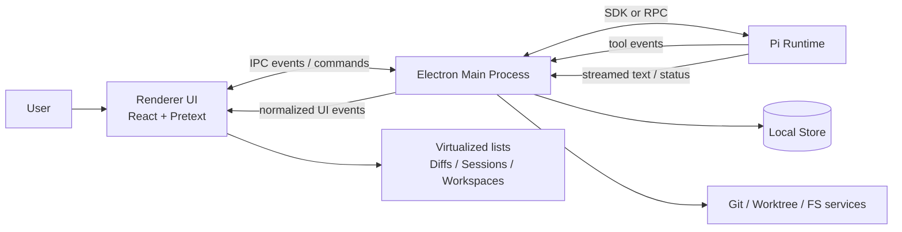

# Supaplane Architecture Proposal

This document captures the first-pass architecture for an Electron desktop app that wraps the Pi coding agent runtime and stays responsive under long sessions, diffs, and workspace switching.

## Goals

- Pi-first desktop workbench, not a chat-first client
- Fast workspace switching and context recovery
- Rich tool and session visualization
- Strong diff and file navigation performance
- Renderer responsiveness under sustained UI churn
- Local-first architecture with a clean runtime boundary

## Process Diagram



### Responsibilities

- **Renderer UI**: draws workspace state, session timeline, diffs, and action cards
- **Electron Main**: owns process lifecycle, workspace orchestration, persistence, and IPC routing
- **Pi Runtime**: runs agent logic, tool execution, and session state
- **Local Store**: persists UI state, session summaries, resume pointers, and user prefs
- **Git / Worktree / FS services**: provide repo state and file operations for workspace awareness

## Electron Module Boundaries

### `main/`

Owns the app runtime and native integration.

Suggested responsibilities:

- Create and manage app windows
- Start and stop the Pi runtime
- Maintain workspace/session registry
- Bridge filesystem, git, and worktree operations
- Persist local application state
- Translate Pi runtime events into renderer-safe IPC events

### `preload/`

Owns the narrow, typed bridge between renderer and main.

Suggested responsibilities:

- Expose a minimal `window.supaplane` API
- Keep IPC channels explicit and typed
- Prevent renderer code from touching Node APIs directly

### `renderer/`

Owns presentation only.

Suggested responsibilities:

- Workspace dashboard
- Session timeline and tool cards
- Diff viewer and file navigation
- Resume / replay / branch / switch actions
- Search and filtering over local session state

### `shared/`

Owns types and schemas shared across processes.

Suggested responsibilities:

- IPC event types
- Workspace and session domain types
- Runtime event normalization schemas
- UI state models

### `runtime/`

Owns the Pi integration layer.

Suggested responsibilities:

- SDK integration or RPC client
- Session lifecycle management
- Event translation from Pi into app events
- Tool call normalization

## IPC Event Schema

The IPC layer should be event-driven, typed, and intentionally small.

### Command channels

| Channel | Direction | Purpose |
|---|---|---|
| `supaplane:workspace/open` | renderer -> main | Open or focus a workspace |
| `supaplane:workspace/refresh` | renderer -> main | Re-read repo and session state |
| `supaplane:session/start` | renderer -> main | Start a new Pi session |
| `supaplane:session/resume` | renderer -> main | Resume an existing session |
| `supaplane:session/fork` | renderer -> main | Fork a session branch |
| `supaplane:agent/send` | renderer -> main | Send a prompt or command to Pi |
| `supaplane:diff/open` | renderer -> main | Open a file diff or patch view |
| `supaplane:file/open` | renderer -> main | Open a file in the workspace |
| `supaplane:git/checkout` | renderer -> main | Switch branches or worktrees |

### Event channels

| Channel | Direction | Purpose |
|---|---|---|
| `supaplane:workspace/state` | main -> renderer | Current workspace snapshot |
| `supaplane:session/state` | main -> renderer | Session lifecycle and metadata |
| `supaplane:agent/event` | main -> renderer | Normalized runtime events |
| `supaplane:agent/token` | main -> renderer | Streamed text deltas |
| `supaplane:agent/tool` | main -> renderer | Tool call start / progress / result |
| `supaplane:git/state` | main -> renderer | Repo, branch, dirty, commit state |
| `supaplane:fs/change` | main -> renderer | File tree or watch updates |
| `supaplane:ui/notify` | main -> renderer | Toasts, errors, approvals, prompts |

### Core payload shapes

```ts
type WorkspaceState = {
  workspaceId: string
  cwd: string
  repoName?: string
  branch?: string
  dirty: boolean
  lastCommit?: string
  freshness: 'active' | 'stale' | 'blocked' | 'done'
  activeSessionId?: string
  summary?: string
}

type SessionState = {
  sessionId: string
  workspaceId: string
  status: 'idle' | 'running' | 'waiting' | 'paused' | 'error' | 'done'
  startedAt: string
  updatedAt: string
  parentSessionId?: string
  forkCount: number
}

type AgentEvent =
  | { type: 'message.delta'; sessionId: string; role: 'user' | 'assistant'; text: string }
  | { type: 'message.final'; sessionId: string; role: 'user' | 'assistant'; text: string }
  | { type: 'tool.start'; sessionId: string; tool: string; input: unknown }
  | { type: 'tool.progress'; sessionId: string; tool: string; message: string }
  | { type: 'tool.result'; sessionId: string; tool: string; output: unknown; ok: boolean }
  | { type: 'status'; sessionId: string; value: 'thinking' | 'waiting' | 'streaming' | 'complete' }
  | { type: 'error'; sessionId: string; message: string }
```

### Design rules

- Keep commands small and intention-based
- Stream tokens separately from final message snapshots
- Normalize runtime events before they hit the renderer
- Make every event identifiable by `workspaceId` and `sessionId`
- Never expose raw Node or filesystem access to the renderer

## Pi SDK vs RPC Decision Matrix

| Criterion | Pi SDK | Pi RPC | Recommendation |
|---|---|---|---|
| Native embedding | Best | Good | SDK if you want direct app integration |
| Isolation from crashes | Moderate | Best | RPC if runtime stability matters most |
| Startup simplicity | Good | Good | Tie |
| Session control | Best | Good | SDK |
| Event streaming | Best | Good | SDK |
| Debuggability | Good | Good | Tie |
| Recovery after failure | Moderate | Best | RPC |
| Packaging complexity | Lower | Slightly higher | SDK |
| Future multi-runtime support | Good | Best | RPC |
| Main-process memory footprint | Higher | Lower | RPC |

### Recommendation

- Use **Pi SDK** for the first implementation if the priority is rich integration and fastest product iteration.
- Use **Pi RPC** if the priority is runtime isolation, restartability, and keeping the Electron main process lightweight.

### Practical choice for Supaplane

Start with **SDK** if:

- you want to drive sessions directly from Electron state
- you want the fewest moving parts during prototyping
- you are comfortable keeping Pi inside the app process boundary

Start with **RPC** if:

- you expect the runtime to crash independently of the UI
- you want the app to supervise and restart Pi cleanly
- you want a clearer boundary for future non-Node clients

## Pretext Integration Points

Pretext should be used where repeated measurement of dynamic text is expensive.

### Best fit areas

- Workspace list rows with variable-length summaries
- Session timeline cards
- Tool output cards
- Diff summary rows and file change previews
- Search results with long labels and snippets
- Any virtualized text-heavy list

### How to use it

1. Measure text once when content or font changes.
2. Cache the prepared handle per text/font pair.
3. Compute height with `layout()` during virtualized list sizing.
4. Keep the renderer free of DOM-based measurement on scroll and resize hot paths.

### Integration pattern

```ts
// Pseudocode
const prepared = prepare(text, font)
const { height, lineCount } = layout(prepared, width, lineHeight)
```

### Renderer architecture guidance

- Pair Pretext with list virtualization for long histories
- Precompute dimensions in a memoized view-model layer, not in React render
- Reuse prepared text handles for stable font/content combinations
- Use it for sizing and layout hints, not for business logic

### What Pretext should not do

- It should not manage stream state
- It should not replace a virtual list library
- It should not be used for every text node by default
- It should not become part of IPC or runtime logic

## Suggested MVP Slice

1. Workspace dashboard with repo and session state
2. Streaming agent transcript with tool cards
3. Diff viewer with virtualized summaries
4. Session resume and fork flow
5. Pretext-backed measurement for long text lists

## Open Questions

- Should Pi run in-process via SDK or be supervised as a subprocess via RPC?
- What is the smallest useful workspace dashboard for the first release?
- How much git/worktree state should be cached locally versus derived live?
- Which panes need Pretext first: sessions, diffs, or workspace lists?
